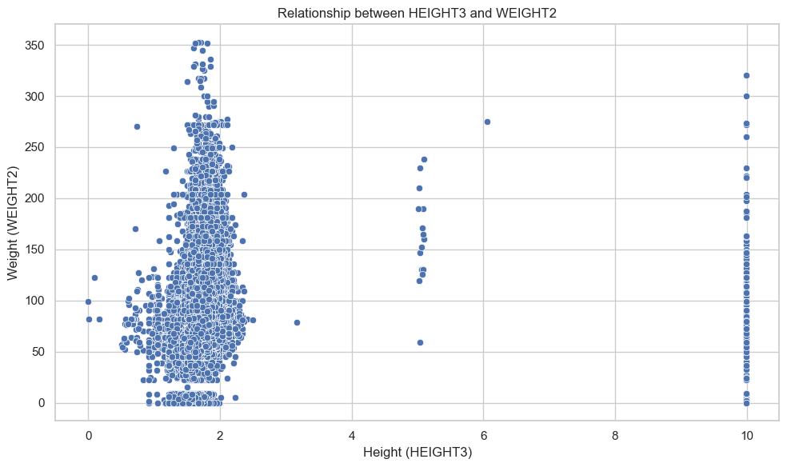
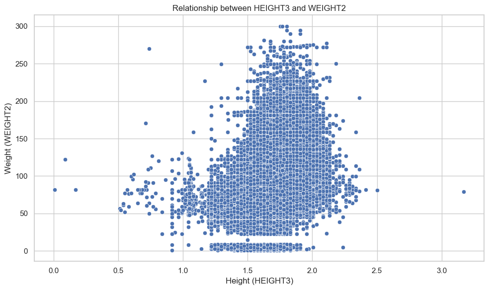
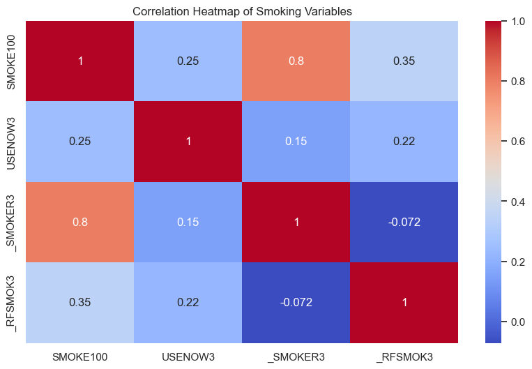
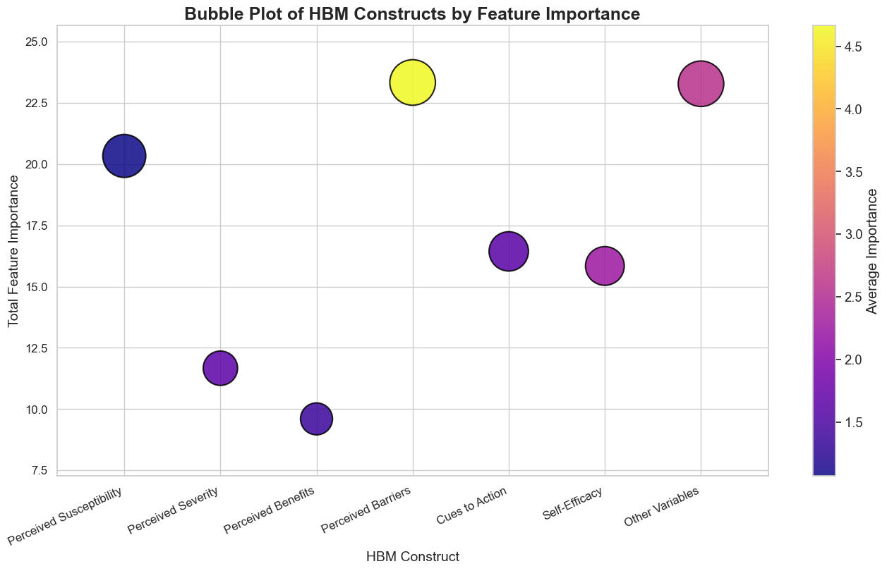
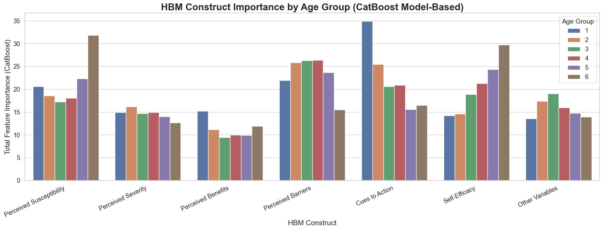

# Why do people smoke ?

On an average there were ~7 million deaths globally in the year 2023 due to smoking, of which ~500,000 deaths were from USA alone. If we evaluate the trends of smoking from 2011 - 2023, we notice that there is a steady decline in smoking prevalence from (15-19%) during 2011-2015, approx. (11-12%) during 2022. Some observations include:
> * In the U.S, smoking rates have steadily declined over the last decade thanks to policy initiatives, media campaigns, taxation, and public health programs.
> * Globally, while smoking rates have fallen, population growth has driven the absolute number of smokers upward, and the smoking-related death toll remains persistently high.

Since habits like smoking stems from psychological normalization of the act, in this project I wanted to evaluate what constructs of the Health Belief Model (HBM) influence it. The bigger effort is also to improve Public policies surrounding dangers of smoking in a way that can help smokers identify their behaviour patterns. I believe with proper messaging of the dangers of smoking by delving into psychological factors, we can bring about real change in this behaviour

Some questions I wanted to answer through this project are:

> **Question 1:** What constructs defined by Health Belief Model (HBM) contribute most towards the habit of smoking ? What are some policy implications?

> **Question 2:** Does this trend vary by age group ?

## 1. Data

The Behavioral Risk Factor Surveillance System (BRFSS) is the nation's premier system of health-related telephone surveys that collect state data about U.S. residents regarding their health-related risk behaviors, chronic health conditions, and use of preventive services. Factors assessed by the BRFSS include tobacco use, health care coverage, HIV/AIDS knowledge or prevention, physical activity, and fruit and vegetable consumption. Data are collected from a random sample of adults (one per household). 
BRFSS Dataset from Kaggle API was gathered for years 2011-2015 and contained 2380047 rows and 645 columns. The reason to choose this was because I wanted to have as many features as possible to evaluate the predictors of smoking.To view the BRFSS data using Kaggle API and the code book report explaining the variables click on the links below:

* [BRFSS Kaggle Dataset](https://www.kaggle.com/datasets/cdc/behavioral-risk-factor-surveillance-system/data)

* [Code Book Report](https://www.cdc.gov/brfss/annual_data/2015/pdf/codebook15_llcp.pdf)

## 2. Method

The aim of the project is to identify the constructs that emerge as the most influencial predictors of smoking. We use the constructs defined by the Health Belief Model (HBM) to categorize the predictors. 

### Health Belief Model (HBM)

The Health Belief Model is a psychological framework developed by Public Health investigators between 1950s-1960s with an attempt to explain and predict health behaviours by focusing on the attitudes and beliefs of individuals. The six main constructs of HBM and its definition for smoking are:

1. **Perceived Susceptibility:** How likely is an individual susceptible to the risks posed by smoking 
i.e. If the individual has heart problems does it make him more likely to be affected negatively by smoking ?

2. **Perceived Severity:** How serious are the consequences if the disease occurs i.e. If the person has a family history of heart disease but personally has none, does he implicitly place himself in the low risk category ?

3. **Perceived Benefits:** It is the belief that a certain action will reduce the risk or severity of the condition i.e. will the person be more excited to hit the gym since his lungs feel better ?

4. **Perceived Barriers:** It accounts for the barriers, obstacles or challenges to taking that action i.e  What factors are causing him to not be able to quit smoking ?

5. **Cues to Action:** External Events or people or factors that motivate people to take action in changing their smoking habits are crucial determinants of change.

6. **Self Efficiency:** A very important variable is the self-belief in being able to successfully quit the smoking behavior required to produce the desired outcomes

7. **Other Variables:** Demographic, sociopsychological, and structural variables affect an individual's perceptions of quitting smoking.

**WINNER: Smoking Prediction Model with good recall and F1-score + HBM construct mapping**

I chose to build a prediction model with higher Recall and F1-score to be aggressive in identifying smokers since it was an imbalanced dataset. As a next step, these features were mapped to the constructs per its definition in the [Code Book Report](https://www.cdc.gov/brfss/annual_data/2015/pdf/codebook15_llcp.pdf). 

## 3. Data Cleaning 

[Data Cleaning Report](https://nbviewer.org/github/rinkylia2997/HealthRecommendationsUsingBehaviouralRiskFactorSurveillanceSystem/blob/main/notebooks/001-rabraham-DataWrangling.ipynb)

In the BRFSS dataset, there were a couple of data inconsistencies that had to be taken care.

* **Problem 1:** The dataset was gathered from telephonic survey so either due to personal reservations of revealing information or due to some issues like lack of time during data collection there were large instances of missing data.  
> **Solution:** Features with missing values > 0.75 threshold was dropped, this brought feature set from 645 columns to 87 columns

* **Problem 2:** As it was a survey dataset, many features served as identifiers of the records and provided less information on smoking habits. These included features like phone number, sequence number. 
> **Solution:** These features were dropped from the dataset to avoid less interference during data exploration and feature engineering

* **Problem 3:** There were many features that captured same information. These included have features like weight in pounds, weight in kgs, calculated weight variable which essential information. 
> **Solution:** We dropped some features by comparing missing values within each type and retaining the most information feature

* **Problem 4:** A lot of features were of type categorical but were represented as float since the values were encoded as codes in [Code Book Report](https://www.cdc.gov/brfss/annual_data/2015/pdf/codebook15_llcp.pdf).  
> **Solution:** This was handled by appropriately converting the features to categorical or ordinal or int/float appropriately.

* **Problem 5:** Some features had erroroneous values. This included features like year that had some values of 2016 when our analysis was conducted for data collected between 2011-2015.  
> **Solution:** These issues were corrected by imputing the columns with correct values based on conditional filtering.

* **Problem 6:** Some features had values belonging to different metric systems. This included features like height and weight were some record values were represented in inches and some in meters, similarly in kilograms and pounds. 
> **Solution:** This was handled by conditional value conversion based on the feature type and conversion formulas.

## 4. EDA

[EDA Report](https://github.com/rinkylia2997/HealthRecommendationsUsingBehaviouralRiskFactorSurveillanceSystem/blob/main/notebooks/002-rabraham-EDA.ipynb)

* **Data Validation:** The wrangled dataset has numerical features including height, weight. Since these are demographic features we need to ensure that these values are within acceptable ranges. To ensure data validity we:

>  check the distribution of these variables by age group and notice that some of them have outliers by visualizing using boxplots and have skewed distribution by plotting histograms. 
>  verify if height and weight values correspond to bmi feature to ensure data consistency.
>  check if there is a pattern of outliers with age since we are interested to know smoking effects by age.

  
                               |
                               |   

 

* **Selection of Target Variable:** Our original aim is to evaluate which features contribute most to identifying a smoker. As surveys usually involve enquiring about a question in multiple forms, there were various labels related to smoking including:
> Smoked at Least 100 Cigarettes? 
> Frequency of Days Now Smoking 
> Use of Smokeless Tobacco Products and 
> many calculated variables to aggregate survey information. 

Part of EDA was to determine a good target variable to be used in our prediction model. We chose to proceed with _RFSMOK3 due to it having least number of classes and least number of missing values and most representative of a smoker compared to other variables. Due to fewer categories of _RFSMOK3, we choose it as our target variable.

* **Map dataset to HBM constructs:** Since we want to identify the psychological and behavioral factors behind smoking, we had to carefully examine the interpretation of features and place them under appropriate HBM construct definitions.

Comprehensive Mapping of Variables to Health Belief Model (HBM) Constructs  

This table maps each variable from the feature set to relevant HBM construct(s) or Other category.

| Variable    | HBM Construct(s)                        | Explanation |
|-------------|-----------------------------------------|-------------|
| GENHLTH     | Susceptibility, Severity                | General health status; poorer health can reflect higher susceptibility to smoking-related complications and greater perceived severity. |
| CVDINFR4    | Susceptibility, Severity                | History of heart attack; increases perceived susceptibility and severity of smoking-related illness. |
| CVDCRHD4    | Susceptibility, Severity                | Coronary heart disease; similar rationale as above. |
| CVDSTRK3    | Susceptibility, Severity                | Stroke; increases perceived susceptibility and severity. |
| ASTHMA3     | Susceptibility, Severity                | Asthma status; higher risk/severity from smoking. |
| CHCSCNCR    | Susceptibility, Severity                | Skin cancer; may increase risk perception. |
| CHCOCNCR    | Susceptibility, Severity                | Other cancer; similar rationale. |
| CHCCOPD1    | Susceptibility, Severity                | COPD; directly linked to smoking, increases risk/severity perception. |
| HAVARTH3    | Susceptibility, Severity                | Arthritis; may influence perceived severity of health issues. |
| ADDEPEV2    | Severity, Self-Efficacy, Susceptibility | Depression diagnosis; affects severity, quitting confidence, and susceptibility. |
| CHCKIDNY    | Susceptibility, Severity                | Kidney disease; increases susceptibility/severity. |
| DIABETE3    | Susceptibility, Severity                | Diabetes; increases smoking-related complication risk. |
| _RFHLTH     | Susceptibility, Severity                | Overall health risk factor. |
| _LTASTH1    | Susceptibility                          | Lifetime asthma indicator. |
| _CASTHM1    | Susceptibility                          | Current asthma indicator. |
| _ASTHMS1    | Susceptibility, Cues to Action          | Asthma summary; may serve as cue. |
| _DRDXAR1    | Susceptibility                          | Arthritis diagnosis. |
| _RFBMI5     | Susceptibility, Self-Efficacy           | High BMI; reflects perceived risk and self-confidence. |
| HLTHPLN1    | Benefits, Barriers                      | Insurance may increase perceived benefits and reduce barriers. |
| CHECKUP1    | Benefits, Cues to Action                | Routine checkup; triggers cues and reinforces benefits. |
| PERSDOC2    | Benefits, Cues to Action                | Having a personal doctor offers support and cues. |
| EXERANY2    | Benefits, Cues to Action, Self-Efficacy | Physical activity; indicates benefits, triggers, and confidence. |
| PNEUVAC3    | Benefits, Cues to Action, Susceptibility| Pneumonia vaccine; proactive behavior. |
| HIVTST6     | Benefits, Cues to Action, Susceptibility| HIV testing; reflects cues and benefits. |
| _TOTINDA    | Benefits, Self-Efficacy                 | Physical activity indicator. |
| MEDCOST     | Barriers                                | Medical cost; barrier to access care/cessation support. |
| RENTHOM1    | Other, Barriers                         | Socioeconomic factor influencing barriers. |
| VETERAN3    | Other, Barriers                         | Veterans may face unique cessation access issues. |
| _EDUCAG     | Other, Barriers                         | Education group; affects literacy and access. |
| _INCOMG     | Other, Barriers                         | Income group; influences ability to quit. |
| USEEQUIP    | Barriers, Severity                      | Use of special equipment reflects limitations. |
| DRNKANY5    | Cues to Action                          | Alcohol use; may cue risky behavior. |
| DROCDY3_    | Cues to Action                          | Days drank alcohol; possible behavioral cue. |
| _RFBING5    | Cues to Action                          | Binge drinking as a cue. |
| _RFSEAT3    | Cues to Action, Self-Efficacy           | Seatbelt use; proxy for self-care/confidence. |
| QLACTLM2    | Severity, Self-Efficacy, Cues to Action | Activity limitation reflects severity and behavioral cues. |
| _STATE      | Other                                   | State of residence; contextual factor. |
| DISPCODE    | Other                                   | Administrative code; response type. |
| SEX         | Other                                   | Biological sex; affects prevalence. |
| MARITAL     | Other                                   | Marital status; social influence. |
| _HCVU651    | Other                                   | Under 65 indicator. |
| _AGE65YR    | Other                                   | Age 65+ indicator. |
| _AGE_G      | Other                                   | Age group indicator. |
| _CHLDCNT    | Other, Cues to Action                   | Number of children; cue for behavioral change. |
| CHILDREN    | Other, Cues to Action                   | Same as above; may signal parenthood role. |
| WEIGHT2     | Other, Self-Efficacy                    | Weight may reflect health confidence. |
| HEIGHT3     | Other, Self-Efficacy                    | Physical profile; might relate to lifestyle. |
| _RFSMOK3    | Susceptibility, Severity                | Target variable: smoking status. |
| YEAR        | Other                                   | Year of survey; context for analysis. |

---

### Key:
> **Susceptibility:** Perception of risk for smoking-related illness.
> **Severity:** Perceived seriousness of consequences.
> **Benefits:** Perceived advantages of quitting or health action.
> **Barriers:** Perceived obstacles to quitting or health action.
> **Cues to Action:** Triggers or reminders to change behavior.
> **Self-Efficacy:** Confidence in ability to quit or maintain health.
> **Other:** Population descriptors for stratification and context.

**Notes:** Some variables appear in multiple constructs due to their multifaceted nature.
---

* **Relationship of each construct with Target Variable:** Once BRFSS features have been mapped to HBM features, we deal with:
> Class imbalance : Combine less frequent groups into a single group simplify modeling 
> Visualize relationship with Target Variable _RFSMOK3 : Plot bar plots for categorical and numerical variables and assess patterns 
> Handle missing values codes for categorical variables as per Code Report: Convert codes 7 to Not sure and 9 Missing together as Not sure 
> Compute Crammer's V Statistic for all categorical variables: To check relationship between categorical variables and drop the ones that exhibit multicollinearity. 

* **Binning zero-imbalance features into fewer buckets:** Variables like number of days of poor mental and physical health have a lot of zeros and to make processing simpler we binned them into managable buckets.

* **Evaluating Data Leakage:** Since there are numerous categorical variables, there was a possibility that target variable _RFSMOK3 is closely related to some of them, we wanted to make sure our model is free of these features. We perform:
> Chi-square test 
> Mutual Information test

## 5. Feature Engineering 

[Feature Engineering Notebook](https://github.com/rinkylia2997/HealthRecommendationsUsingBehaviouralRiskFactorSurveillanceSystem.git)

This notebook contains preparation tasks of the explored dataset, including one-hot encoding categorical and standardizing numeric features. 
The datasets both encoded and original are split into test and train sets to ensure that all the models are evaluated against same data i.e it is a way of setting seed prior to training the model. 

We finish this section by saving both encoded and original datasets to use trial and error approach of which yields a better smoking prediction model with high recall, F1-score and PR-AUC. 

## 6. Modeling (Machine Learning Algorithms) and Analysis

[Modeling Notebook](https://github.com/rinkylia2997/HealthRecommendationsUsingBehaviouralRiskFactorSurveillanceSystem/blob/main/notebooks/004-modeling.ipynb)

We begin by importing both encoded and original datasets from Feature Engineering Notebook. I wanted to evaluate smoking prediction using 2 algorithms [CatBoost and LightGBM]-  both belonging to Gradient Boost algorithms. 
I opted for gradient boosting since our dataset has a mix of categorical and numeric variables and having an ensemble learning method will yield a stronger predictor by combining many weak learners. Each algorithm is trained with different hyperparameters i.e a base model with default parameters and a tuned model by providing a list of hyperparameters. The two modeling algorithms applied on BRFSS dataset are:

> 1. **CatBoost:** I chose to train the original dataset (Features not encoded) using this algorithm since it natively handles categorical values. The training time for this model was on the higher end averaging ~xxxx for both tuned and untuned models.
Here's a summary of performance of Base and Tuned Catboost models

> 2. **LightGBM:** I used the encoded dataset since this algorithm does better when encoded explicity before training. This is mainly a choice to see if I will get similar results of Catboost in less time and it successfully met my assumption. Here's a breakdown of model evaluation metrics of Base and Tuned LightGBM models

#### Model Comparison Chart

| Model           | Accuracy  | Precision | Recall   | F1-Score | ROC-AUC  | PR-AUC   | Training Time |
|-----------------|-----------|-----------|----------|----------|----------|----------|---------------|
| CatBoost        | 0.729721  | 0.333598  | 0.713685 | 0.454670 | 0.796675 | 0.458032 | 1144.751788   |
| CatBoost Tuned  | 0.730858  | 0.334517  | 0.712342 | 0.455249 | 0.796907 | 0.458349 | 1831.023640   |
| LightGBM        | 0.728925  | 0.332754  | 0.713301 | 0.453807 | 0.795863 | 0.456280 | 16.839819     |
| LightGBM Tuned  | 0.730335  | 0.333869  | 0.711520 | 0.454481 | 0.796365 | 0.457688 | 3298.030455   |

We select **CatBoost** Model as our winner because it performed best against other models for Recall and second best in PR-AUC, ROC-AUC, F1-Score compared to other models. It is considerably high in Training time, but is still the second best from the above table

## Analysis

### Question 1: What constructs defined by Health Belief Model (HBM) contribute most towards the habit of smoking ? What are some policy implications?
1. Since we are interested to know which constructs emerge as prominent determinant of smoking, we aggregate total_importance and average_imporatance scores from top feature set of CatBoost model and plot a bubble plot showing the effect of each construct on the target variable.

#### Key Insights from Feature Importance Analysis

#### 1. Which Health Belief Model (HBM) Constructs Mattered Most?

Using CatBoost’s feature importances, we grouped and visualized the impact of predictors by their corresponding **HBM constructs**. The bubble chart below shows Total Importance (Y-axis), Average Importance (Color), and Number of Features (Bubble Size).

| Construct              | Total Importance | Avg. Importance | Takeaway |
|------------------------|------------------|------------------|----------|
| **Perceived Barriers** | Highest          | **Highest**      | Most critical in smoking prediction—barriers like income, education, and cost matter. |
| **Other Variables**    | Very High        | Moderate         | Demographics (e.g., age, marital status) still play a large role. |
| **Perceived Susceptibility** | High       | Low              | Many small-risk features (e.g., chronic conditions) together matter. |
| **Cues to Action**     | Moderate         | Moderate         | Behavioral triggers like binge drinking and checkups matter. |
| **Self-Efficacy**      | Moderate         | Moderate         | Features like physical activity, weight, and BMI help reflect confidence to quit. |
| **Perceived Severity** | Lower            | Lower            | Severity alone (e.g., general health, mental health) had less direct predictive power. |
| **Perceived Benefits** | Lowest           | Lowest           | Although important theoretically, these were not strong predictors in the data.

---

#### 2. Top Features Driving Smoking Behavior

From the final CatBoost model’s feature importances:

| Rank | Feature       | Importance | HBM Construct(s)       | Interpretation |
|------|---------------|------------|------------------------|----------------|
| 1    | `_EDUCAG`     | 15.54      | **Perceived Barriers** | Lower education limits access to cessation resources. |
| 2    | `_AGE65YR`    | 9.62       | Other                  | Seniors (65+) showed distinct smoking behavior trends. |
| 3    | `MARITAL`     | 7.18       | Other                  | Social isolation or support plays a role. |
| 4    | `_RFBING5`    | 6.01       | **Cues to Action**     | Binge drinking co-occurs with smoking. |
| 5    | `WEIGHT2`     | 5.06       | **Self-Efficacy**      | Indicates belief in personal control over health. |
| 6    | `CHCCOPD1`    | 4.89       | **Susceptibility**     | Respiratory illness increases smoking risk awareness. |
| 7    | `GENHLTH`     | 4.80       | **Susceptibility**     | Self-perceived poor health is a relevant indicator. |
| 8    | `_INCOMG`     | 4.16       | **Perceived Barriers** | Lower income directly hinders quitting efforts. |
| 9    | `HEIGHT3`     | 3.47       | Self-Efficacy          | General health proxy; associated with confidence. |
| 10   | `_RFBMI5`     | 3.18       | Self-Efficacy          | Weight management is linked to behavior change confidence. |

Other notable contributors:
- **Healthcare access**: `CHECKUP1`, `MEDCOST`, `PERSDOC2`
- **Chronic illness**: `CHCKIDNY`, `DIABETE3`, `ASTHMA3`, `CVDCRHD4`
- **Behavioral triggers**: `DRNKANY5`, `_TOTINDA`, `HIVTST6`, `PNEUVAC3`

---

#### 3. Final Reflections

- **Perceived Barriers** are the most *actionable* levers for intervention (e.g., cost, education, insurance).
- **Demographics** (e.g., age, marital status) remain foundational and cannot be ignored.
- **Cues to Action** like binge drinking or routine checkups signal **opportune moments** for targeted messaging.
- **Self-efficacy** indicators (weight, activity) matter more than perceived severity.

This insight strengthens the **policy implications** of this study:
> Effective anti-smoking strategies should prioritize **removing barriers**, **targeting at-risk groups**, and **leveraging behavioral triggers**—not just warnings about long-term severity.

### Question 2: Does this trend vary by age group ?
2. We also wanted to check if the trend was influenced by age and we can confirm that the age of the person was indeed a big contributor to the habit of smoking. I went one step further to check how the classifier behaves for different age groups and we notice that the following trend.

#### HBM Construct Importance by Age Group (CatBoost Model)

This chart breaks down the **predictive power of each HBM construct** across 6 age groups:

| Age Group Code | Age Range     |
|----------------|---------------|
| 1              | 18–24         |
| 2              | 25–34         |
| 3              | 35–44         |
| 4              | 45–54         |
| 5              | 55–64         |
| 6              | 65+           |

---

#### Key Observations by Construct

#### Perceived Susceptibility
- **Highest in Group 5 (55–64)**: Older adults likely associate chronic illness and comorbidities with smoking risk.
- **Also high in 18–24**: Young adults might have growing awareness due to early health education.

#### Perceived Severity
- Relatively **flat across groups**, but dips slightly for 65+ (Group 6).
- Indicates **severity alone is less differentiating** for older smokers, possibly due to desensitization or already-established behavior.

#### Perceived Benefits
- Highest in **18–24**: Young adults show stronger belief in the benefits of quitting.
- Dips for middle age (Groups 3–5), suggesting **behavior inertia** or resignation.

#### Perceived Barriers
- **Most influential for middle-aged groups (2–4)**: Barriers like cost, lack of support, or time pressures may peak during life/work stress.
- **Drops sharply in 65+**, possibly due to Medicare, time availability, or resolved stressors.

#### Cues to Action
- **Most predictive for 18–24**, but importance **declines with age**.
- Suggests that **external triggers** (e.g. binge drinking, peer influence, checkups) are key to early interventions.

#### Self-Efficacy
- **Increases with age**, peaking at **65+**.
- Older adults may feel more control over health or have more time to manage habits.

#### Other Variables
- Slightly higher in **middle-aged adults (35–44)**.
- These reflect demographic background rather than psychological determinants.

---

#### Strategic Insights

- **18–24 (Group 1)**: Most influenced by **Cues to Action** and **Perceived Benefits**. Campaigns for this group should focus on rewards of quitting, peer triggers, and visible lifestyle changes.
- **25–54 (Groups 2–4)**: Dominated by **Barriers**. Interventions should remove economic, social, and access-related obstacles.
- **55–64 (Group 5)**: Influenced most by **Susceptibility**. Messaging about risk awareness and disease consequences resonates here.
- **65+ (Group 6)**: High on **Self-Efficacy**, **Susceptibility**, and **Benefits**. They may be most ready for cessation with the right support—empowerment is key.

---

#### Final Takeaway

**Interventions must be tailored by age**:
- Youth: Highlight **benefits** and respond to **triggers**.
- Mid-life: Tackle **barriers** and link smoking to **long-term damage**.
- Seniors: **Empower** them with support, reassurance, and health management.

## 8. Future Improvements

* In the future, I would love to spend more time creating a dashboard with different tabs explaining the purpose of project, to sample data from the smoking subset and evaluate how we can introduce changes to current policy that will target the right constructs to reduce smoking among people.

* I would also like to add more recent data to my project (~2021-2024) to evaluate differences in smoking habits and differences in constructs over a decade. 

## 9. Credits

Thanks to Jaleed Khan and Vinit Koshti, my springboard mentor who helped me combine my interest in public health and behavioral psychology to a tangible dataset. I really helped me narrow down my problem statement.

## Part 2

## 

